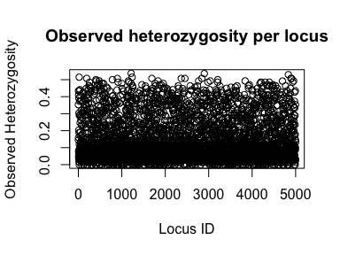
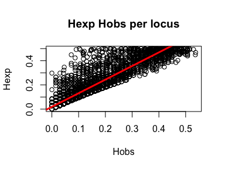

Final Population Genetics Project
================
Amy Benefield
21 November, 2019

Libraries:

``` r
library("adegenet")
library("hierfstat")
library("pegas")
```

# Data Cleaning and Exploratory Data Analysis

#### Reading in Data:

``` r
data<-read.table("Dataset3.genind.txt", sep="", header=TRUE)
head(data[1:10])
```

    ##   sample           pop SNPlocus_1 SNPlocus_2 SNPlocus_3 SNPlocus_4
    ## 1      2 south_georgia        0/0        0/0        0/0        0/0
    ## 2      3 south_georgia        1/1        0/0        0/0        0/0
    ## 3      7 south_georgia        0/0        0/0        0/0        0/0
    ## 4      8 south_georgia        0/0        0/1        1/1        0/0
    ## 5     10 south_georgia        0/0        0/0        0/0        0/0
    ## 6     11 south_georgia        0/0        0/0        0/0        0/0
    ##   SNPlocus_5 SNPlocus_6 SNPlocus_7 SNPlocus_8
    ## 1        0/0        1/1        0/0        0/0
    ## 2        0/0        0/0        0/0        0/0
    ## 3        0/0        0/1        0/0        0/0
    ## 4        0/0        0/1        0/0        0/0
    ## 5        0/0        0/1        0/0        0/0
    ## 6        0/0        0/1        0/0        0/0

``` r
loci<-data[,c(-1,-2)]
head(loci[1:10])
```

    ##   SNPlocus_1 SNPlocus_2 SNPlocus_3 SNPlocus_4 SNPlocus_5 SNPlocus_6
    ## 1        0/0        0/0        0/0        0/0        0/0        1/1
    ## 2        1/1        0/0        0/0        0/0        0/0        0/0
    ## 3        0/0        0/0        0/0        0/0        0/0        0/1
    ## 4        0/0        0/1        1/1        0/0        0/0        0/1
    ## 5        0/0        0/0        0/0        0/0        0/0        0/1
    ## 6        0/0        0/0        0/0        0/0        0/0        0/1
    ##   SNPlocus_7 SNPlocus_8 SNPlocus_9 SNPlocus_10
    ## 1        0/0        0/0        0/0         0/0
    ## 2        0/0        0/0        0/0         0/1
    ## 3        0/0        0/0        0/0         0/0
    ## 4        0/0        0/0        0/0         0/0
    ## 5        0/0        0/0        0/0         0/0
    ## 6        0/0        0/0        1/1         0/0

``` r
str(loci[1:10])
```

    ## 'data.frame':    69 obs. of  10 variables:
    ##  $ SNPlocus_1 : Factor w/ 3 levels "0/0","0/1","1/1": 1 3 1 1 1 1 1 2 2 1 ...
    ##  $ SNPlocus_2 : Factor w/ 2 levels "0/0","0/1": 1 1 1 2 1 1 1 1 1 1 ...
    ##  $ SNPlocus_3 : Factor w/ 3 levels "0/0","0/1","1/1": 1 1 1 3 1 1 2 1 1 2 ...
    ##  $ SNPlocus_4 : Factor w/ 3 levels "0/0","1/0","1/1": 1 1 1 1 1 1 1 1 1 1 ...
    ##  $ SNPlocus_5 : Factor w/ 3 levels "0/0","0/1","1/1": 1 1 1 1 1 1 1 1 1 1 ...
    ##  $ SNPlocus_6 : Factor w/ 3 levels "0/0","0/1","1/1": 3 1 2 2 2 2 2 1 2 2 ...
    ##  $ SNPlocus_7 : Factor w/ 2 levels "0/0","0/1": 1 1 1 1 1 1 1 1 1 1 ...
    ##  $ SNPlocus_8 : Factor w/ 2 levels "0/0","1/0": 1 1 1 1 1 1 1 1 1 1 ...
    ##  $ SNPlocus_9 : Factor w/ 3 levels "0/0","1/0","1/1": 1 1 1 1 1 3 1 1 1 2 ...
    ##  $ SNPlocus_10: Factor w/ 3 levels "0/0","0/1","1/1": 1 2 1 1 1 1 1 1 1 1 ...

#### Labels of the individuals

``` r
index <- as.character(data$sample)
```

#### Labels of the populations

``` r
pops <- as.character(data$pop)
```

## Transform from dataframe to genind:

``` r
data_genind <- df2genind(loci, ploidy = 2, ind.names = index, 
                          pop = pops, sep = "/") 
```

    ## Warning in df2genind(loci, ploidy = 2, ind.names = index, pop = pops, sep =
    ## "/"): duplicate labels detected for some individuals; using generic labels

``` r
data_genind
```

    ## /// GENIND OBJECT /////////
    ## 
    ##  // 69 individuals; 5,000 loci; 9,965 alleles; size: 5.3 Mb
    ## 
    ##  // Basic content
    ##    @tab:  69 x 9965 matrix of allele counts
    ##    @loc.n.all: number of alleles per locus (range: 1-2)
    ##    @loc.fac: locus factor for the 9965 columns of @tab
    ##    @all.names: list of allele names for each locus
    ##    @ploidy: ploidy of each individual  (range: 2-2)
    ##    @type:  codom
    ##    @call: df2genind(X = loci, sep = "/", ind.names = index, pop = pops, 
    ##     ploidy = 2)
    ## 
    ##  // Optional content
    ##    @pop: population of each individual (group size range: 10-13)

## Hardy\_Weinberg Tests and P-Values:

``` r
hw<-hw.test(data_genind, B=0)
pvals<-hw[,3]
num_loci<-subset(pvals,pvals<0.05)
print("Number of loci outside of HWE:") 
```

    ## [1] "Number of loci outside of HWE:"

``` r
length(num_loci)
```

    ## [1] 1639

MCMC Permutation:

``` r
#HW<-hw.test(data_genind, B = 1000)
#PVALS<-HW[,4]
#NUM_loci<-subset(PVALS,PVALS<0.05)
#print("Number of loci outside of HWE:") 
#length(NUM_loci)
```

# Diversity Statistics

Now that everything is formatted properly we can calculate genetic
diversity (observed and expected heterozygosity). First, we’ll do this
with adegenet: Lets create a new object called “DIV” that summarizes the
information in our pines\_genind object

``` r
DIV <- summary(data_genind)
names(DIV)## this tells us the names of each slot of the DIV object
```

    ## [1] "n"         "n.by.pop"  "loc.n.all" "pop.n.all" "NA.perc"   "Hobs"     
    ## [7] "Hexp"

``` r
DIV$n
```

    ## [1] 69

``` r
DIV$n.by.pop
```

    ##    south_georgia falkland_islands     george_point     jougla_point 
    ##               10               11               12               13 
    ##   south_shetland        kerguelen 
    ##               11               12

``` r
DIV$loc.n.all[1:10]
```

    ##  SNPlocus_1  SNPlocus_2  SNPlocus_3  SNPlocus_4  SNPlocus_5  SNPlocus_6 
    ##           2           2           2           2           2           2 
    ##  SNPlocus_7  SNPlocus_8  SNPlocus_9 SNPlocus_10 
    ##           2           2           2           2

``` r
DIV$pop.n.all
```

    ##    south_georgia falkland_islands     george_point     jougla_point 
    ##             6834             6922             6768             6759 
    ##   south_shetland        kerguelen 
    ##             6684             8422

``` r
DIV$NA.perc
```

    ## [1] 1.008696

``` r
DIV$Hobs[1:10]
```

    ##  SNPlocus_1  SNPlocus_2  SNPlocus_3  SNPlocus_4  SNPlocus_5  SNPlocus_6 
    ##  0.35294118  0.14492754  0.43478261  0.15942029  0.07692308  0.40909091 
    ##  SNPlocus_7  SNPlocus_8  SNPlocus_9 SNPlocus_10 
    ##  0.04347826  0.05797101  0.20289855  0.39130435

``` r
DIV$Hexp[1:10]
```

    ##  SNPlocus_1  SNPlocus_2  SNPlocus_3  SNPlocus_4  SNPlocus_5  SNPlocus_6 
    ##  0.40268166  0.13442554  0.38563327  0.36389414  0.10189349  0.44938017 
    ##  SNPlocus_7  SNPlocus_8  SNPlocus_9 SNPlocus_10 
    ##  0.04253308  0.05629070  0.20499895  0.41766436

### Look at proportion of heterozygosity per locus:

``` r
plot(DIV$Hobs, xlab="Locus ID", ylab="Observed Heterozygosity", 
     main="Observed heterozygosity per locus")
```

<!-- -->

### We also want to compare observed and expected heterozygosity

``` r
plot(DIV$Hobs,DIV$Hexp, xlab="Hobs", ylab="Hexp", 
     main="Hexp Hobs per locus")
lm<-lm(DIV$Hexp~DIV$Hobs)
summary(lm)
```

    ## 
    ## Call:
    ## lm(formula = DIV$Hexp ~ DIV$Hobs)
    ## 
    ## Residuals:
    ##      Min       1Q   Median       3Q      Max 
    ## -0.17303 -0.02606 -0.02299  0.01046  0.37143 
    ## 
    ## Coefficients:
    ##             Estimate Std. Error t value Pr(>|t|)    
    ## (Intercept) 0.018949   0.001120   16.92   <2e-16 ***
    ## DIV$Hobs    1.124986   0.006609  170.22   <2e-16 ***
    ## ---
    ## Signif. codes:  0 '***' 0.001 '**' 0.01 '*' 0.05 '.' 0.1 ' ' 1
    ## 
    ## Residual standard error: 0.05604 on 4998 degrees of freedom
    ## Multiple R-squared:  0.8529, Adjusted R-squared:  0.8529 
    ## F-statistic: 2.898e+04 on 1 and 4998 DF,  p-value: < 2.2e-16

``` r
abline(lm, col="red", lwd=3)
```

<!-- -->

##### Now we can test if there a significant difference between observed and expected heterozygosity:

Check the variances are equal:

``` r
bartlett.test(list(DIV$Hexp, DIV$Hobs))
```

    ## 
    ##  Bartlett test of homogeneity of variances
    ## 
    ## data:  list(DIV$Hexp, DIV$Hobs)
    ## Bartlett's K-squared = 193.39, df = 1, p-value < 2.2e-16

**VARIANCE ISN’T EQUAL**: p-value \< 2.2e-16: Probably need to do some
data
transformation

``` r
t.test(DIV$Hexp, DIV$Hobs, paired = T, alternative = "greater", var.equal = TRUE)
```

    ## 
    ##  Paired t-test
    ## 
    ## data:  DIV$Hexp and DIV$Hobs
    ## t = 41.334, df = 4999, p-value < 2.2e-16
    ## alternative hypothesis: true difference in means is greater than 0
    ## 95 percent confidence interval:
    ##  0.0325573       Inf
    ## sample estimates:
    ## mean of the differences 
    ##              0.03390686

# Basic Statistics with Hierfstat:

Now, let’s do basic statistics with hierfstat. We need to convert genind
object to a hierfstat object, because sometimes analysis in R is dumb
and requires lots of reformatting. This format is needed to analyze
pairwise FST. Create hierfstat object where populations are sites:

``` r
data_hier <- genind2hierfstat(data_genind)
```

The function basic.stats() provides the observed heterozygosity (Ho),
mean gene diversities within population (Hs), Fis, and Fst. The function
boot.ppfis() provides confidence interval for Fis. Calculate basic stats
on dataset:

``` r
basicstat_final <- basic.stats(data_hier, diploid = TRUE, digits = 2)
# Calling, "basicstat_final" gives a summary of the information contained in the slots (the perloc and overall options), but we won't do that, because it's a large dataset:
# basicstat_final
```

Let’s first look at the relationship between sample size and
heterozygosity. We’re going to use the “apply” function to summarize the
data tables in different slots of our basicstat\_final object. It
creates an object where we the average sample size for each locus in
each pop. This is the mean of each column in the
basicstat\_final$n.ind.samp slot:

``` r
sample.size<-apply(basicstat_final$n.ind.samp, 2 ,mean) 
```

Average Ho for each locus in each pop. This is the mean of each column
in the basicstat\_final$Ho slot:

``` r
ho<-apply(basicstat_final$Ho, 2 ,mean)
```

Now we plot those two values agains each other:

``` r
plot(sample.size, ho) ## plot Ho against sample size
```

<!-- -->

Ok- now let’s plot Hs (the average heterozygosity of subdivided pops)
against Ht (the pooled heterozygosity). You’ll see that these values are
columns in the basicstat\_final$perloc slot.We can just plot those
columns against each
other:

``` r
plot(basicstat_final$perloc$Hs, basicstat_final$perloc$Ht, xlab="Hs in subdivided populations", 
     ylab="Ht in pooled popultions")
```

<!-- -->

``` r
plot(basicstat_final$perloc$Fst)
```

<!-- -->

### Fst:

Weir & Cockerham’s Fst

``` r
wc(data_genind)
```

    ## $FST
    ## [1] 0.2154904
    ## 
    ## $FIS
    ## [1] 0.04863081

**Pairwise Fst**- this gives us the Fst between each pair of populations
using Weir and Cockerham’s estimator. This is a measure of genetic
distance bewteen each pair of populations. This calculation might take a
minute:

``` r
fst.dist<-genet.dist(data_genind, method = "WC84")
fst.dist
```

    ##                  south_georgia falkland_islands george_point jougla_point
    ## falkland_islands   0.233202497                                           
    ## george_point       0.117326424      0.257559707                          
    ## jougla_point       0.122395049      0.258755937  0.008603233             
    ## south_shetland     0.117898073      0.260558071  0.010481013  0.016425565
    ## kerguelen          0.262996150      0.261954635  0.294291897  0.301574056
    ##                  south_shetland
    ## falkland_islands               
    ## george_point                   
    ## jougla_point                   
    ## south_shetland                 
    ## kerguelen           0.290952335

``` r
max(fst.dist) ## maximum pairwise fst
```

    ## [1] 0.3015741

``` r
min(fst.dist) ## minimum pairwise fst
```

    ## [1] 0.008603233

``` r
mean(fst.dist) ## mean fst across all pairs
```

    ## [1] 0.187665

# Pairwise Fst and Isolation by Distance (IBD)

Let’s look for evidence of isolation by distance. If you get a message
asking to restart R, click “no”.

More libraries:

``` r
library(geonames)
library(data.table)
library(purrr)
library(geosphere)
```

Create an object that contains the name of each state where sampling was
done. This pulls out each unique island from our dataset and puts them
in a vector:

``` r
islands<-sort(unique(data$pop)) 
islands
```

    ## [1] falkland_islands george_point     jougla_point     kerguelen       
    ## [5] south_georgia    south_shetland  
    ## 6 Levels: falkland_islands george_point jougla_point ... south_shetland
