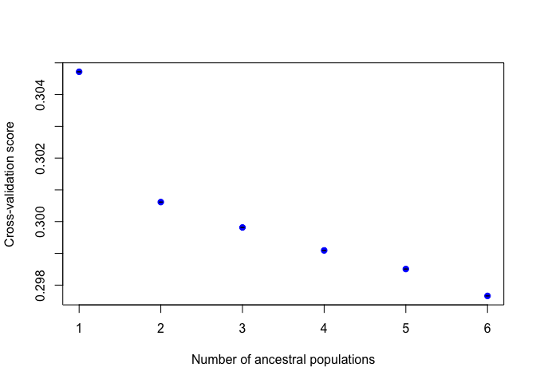

TESS Structure Analyses
================
Amy Benefield
22 November, 2019

Libraries:

``` r
library("devtools")
library(OutFLANK)
library(LEA)
library(tess3r)
library(mapplots)
library(fields)
library(dplyr)
library(ggplot2)
library(raster)
library(rworldmap)
library(maps)
source("http://membres-timc.imag.fr/Olivier.Francois/Conversion.R") ## supplemental functions
source("http://membres-timc.imag.fr/Olivier.Francois/POPSutilities.R") ## supplemental functions
```

    ## [1] "Loading fields"
    ## [1] "Loading RColorBrewer"

    ## Warning in helpPops(): Available functions: 
    ## 
    ##  HELP: 
    ##    * helpPops() 
    ## 
    ##  
    ##  SHOW EXAMPLE: 
    ##    * Open the R script scriptExample.r 
    ## 
    ##  
    ##  CORRELATION UTILITIES: 
    ##  Compute correlation between matrix of membership/admixture coefficients (from matrix or from POPS outputs) 
    ##    * correlation(matrix1,matrix2,plot=TRUE,colors=defaultPalette) 
    ##    * correlationFromPops(file1,file2,nind,nskip1=2,nskip2=2,plot=TRUE,colors=defaultPalette) 
    ## 
    ##  
    ##  BARPLOT UTILITIES: 
    ##  Display barplot of membership/admixture coefficients (from matrix or from POPS output) 
    ##  * barplotCoeff(matrix,colors=defaultPalette,...) 
    ##  * barplotFromPops(file1,nind,nskip1=2,colors=defaultPalette,...) 
    ## 
    ##  
    ##  MAPS UTILITIES: 
    ##  Display maps of membership/admixture coefficients (from matrix or from POPS output) 
    ##    * maps(matrix,coord,grid,constraints=NULL,method="treshold",colorGradientsList=lColorGradients,onemap=T,onepage=T,...) 
    ##    * mapsFromPops(file,nind,nskip=2,coord,grid,constraints=NULL,method="treshold",colorGradientsList=lColorGradients,onemap=T,onepage=T,...) 
    ##  Create grid on which coefficients will be displayed 
    ##    * createGrid(min_long,max_long,min_lat,max_lat,npixels_long,npixels_lat) 
    ##    * createGridFromAsciiRaster(file) 
    ##    * getConstraintsFromAsciiRaster(file,cell_value_min=NULL,cell_value_max=NULL) 
    ##  Legend for maps 
    ##    * displayLegend(K=NULL,colorGradientsList=lColorGradients)

Using TESS:
<https://bcm-uga.github.io/TESS3_encho_sen/articles/main-vignette.html>
This is the TESS website, which has a nice guide for using the program

Read in the data

``` r
dataset1<-read.table("dataset1.geno")
dim(dataset1) # 226 individuals: 15000 SNPs
```

    ## [1]   226 15000

``` r
head(dataset1)[1:10]
```

    ##   V1 V2 V3 V4 V5 V6 V7 V8 V9 V10
    ## 1  0  0  2  0  0  1  2  0  0   0
    ## 2 NA  1  2  1  0 NA NA NA NA   0
    ## 3  1  0  2  0  0  0  2  0  0   0
    ## 4  1  0  2  0  0 NA  0  0  0   0
    ## 5  0  0  2  2  0  2 NA NA  0   0
    ## 6  2  0  2  0  0  0 NA  0  0   0

``` r
coords1<-read.table("dataset1.coord", header=FALSE, sep="")
head(coords1)
```

    ##         V1       V2
    ## 1 37.74458 56.73177
    ## 2 37.74458 56.73177
    ## 3 37.74458 56.73177
    ## 4 37.74458 56.73177
    ## 5 37.74458 56.73177
    ## 6 37.74458 56.73177

``` r
coords1<-as.matrix(coords1) # Convert to a matrix for the program to work properly
```

We have 226 individuals and 15000 SNPs. Rows are individuals, columns
are SNPs.

This is the main clustering command, but it takes a while to run, so I’m
running it once, and saving it to an R object in the script,
“Tess\_Final.R”. So, I’ll read the object back in here. I’m keeping
the code to keep track of everything.

``` r
#dataset1.TESS<- tess3(X = dataset1,
#                      coord = coords1,
#                      ploidy = 2,
#                      K = 1:6,
#                      rep = 1,
#                      max.iteration=1000)
dataset1.TESS<-readRDS(file="dataset1.TESS.rds")
```

We tell it the dataset (X) = dataset1. The coord = the coords1 object.
Ploidy is diploid (2). Fit K from 1-6. Do 1 repetition per K. Iterate
the program 1000 times. Now we plot the cross validation to help choose
K. The best choice for the K value is when the cross-validation curve
exhibits a plateau or starts increasing.

``` r
plot(dataset1.TESS, pch = 19, col = "blue",
     xlab = "Number of ancestral populations",
     ylab = "Cross-validation score")
```

<!-- -->

OK, let’s make structure-style barplots now. The q matrix is the object
TESS created that has the assignment proportions for each individual.
The number of columns in this object corresponds to the number of
clusters (k)- so K=3 has 3 columns. Each row is an individual. The
values for each column for each individual (row) are the proportions of
its genotype assigned to each cluster. So to make the barplot, we’re
going to plot the values for each individual as one bar. You can
envision this as the rows of the q matrix being tipped on their sides,
so each row is turned into one bar on the bar plot. The amount of each
color in each bar corresponds to the proportions of ancestry- so an
individual with 0.5 in each cluster will have a bar that is half one
color, half the other color. You can change the value of K here to make
plots for different K values:

``` r
q.matrix.dataset1 <- qmatrix(dataset1.TESS, K = 2) 
head(q.matrix.dataset1)
```

    ##           [,1]       [,2]
    ## [1,] 0.9408060 0.05919402
    ## [2,] 0.9471425 0.05285752
    ## [3,] 0.9446303 0.05536969
    ## [4,] 0.9473760 0.05262397
    ## [5,] 0.9427895 0.05721045
    ## [6,] 0.9449050 0.05509497

Make the STRUCTURE-like barplot for the Q-matrix:

``` r
barplot(q.matrix.dataset1, border=NA, space = 0,
        xlab = "Individuals", ylab = "Ancestry proportions", 
        main = "Ancestry matrix") ->bp
```

    ## Use CreatePalette() to define color palettes.

<!-- --> This command makes a bar
plot from the q.matrix. Border = “gray50” is the color of the borders of
the bars. You can try changing this, or set border = NA. Space = 0 means
no spaces between bars- try deleting this and re-doing your plot and see
what happens.

### Geographic Coordinates

A cool thing about TESS is that it is a spatially explicit model. That
is, we can incorporate information about geographic sampling location
into our models. Here, let’s plot how our measures of ancestry
(assignment to different genetic clusters) vary across the landscape.
We’ll use the coords file to tell TESS where each sample came from
(its geographic coordinates). Here, you can change which q.matrix and
coord objects are entered. So, if you want to plot the q.matrix from
dataset3, you can change this to q.matrix.map\<-q.matrix3. Just make
sure the q.matrix and coords match- so q.matrix from dataset3 and
coords3 etc. You can go back and change the value of K in your q-matrix,
and then see how your map changes.
